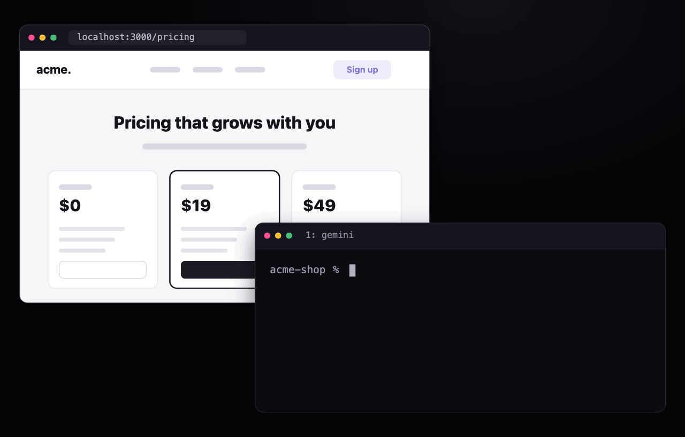
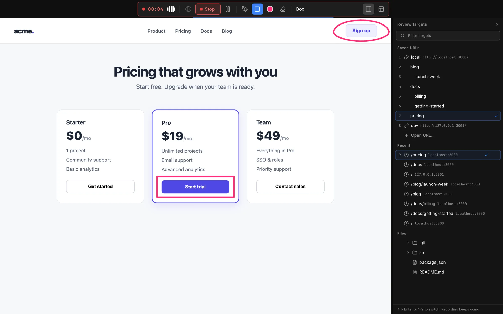
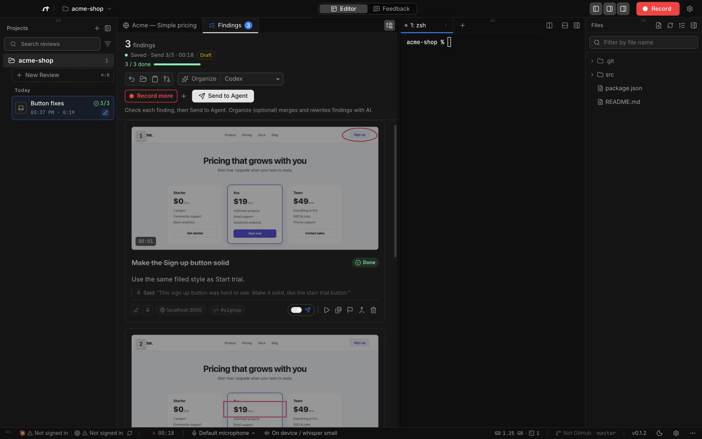
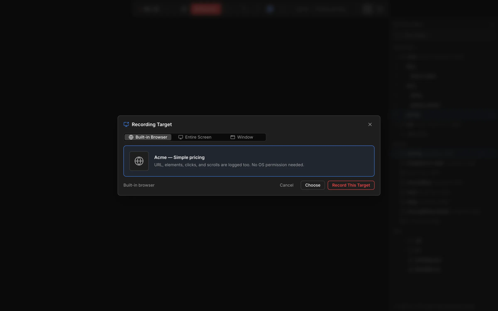
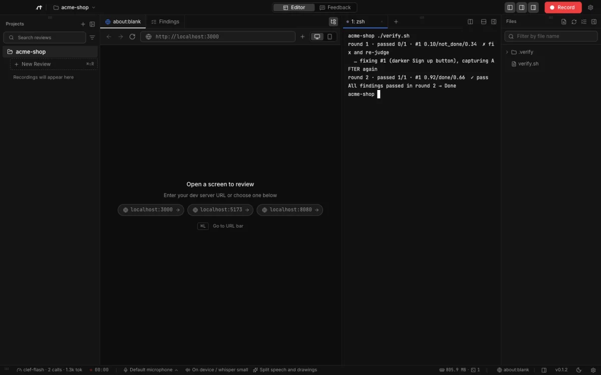
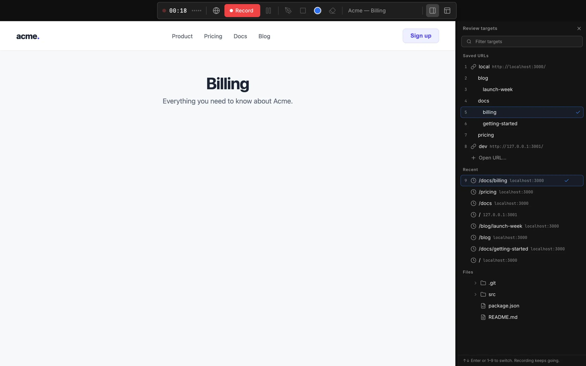
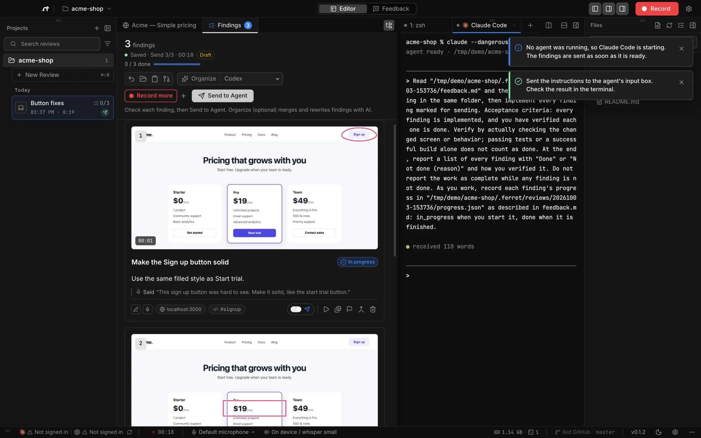
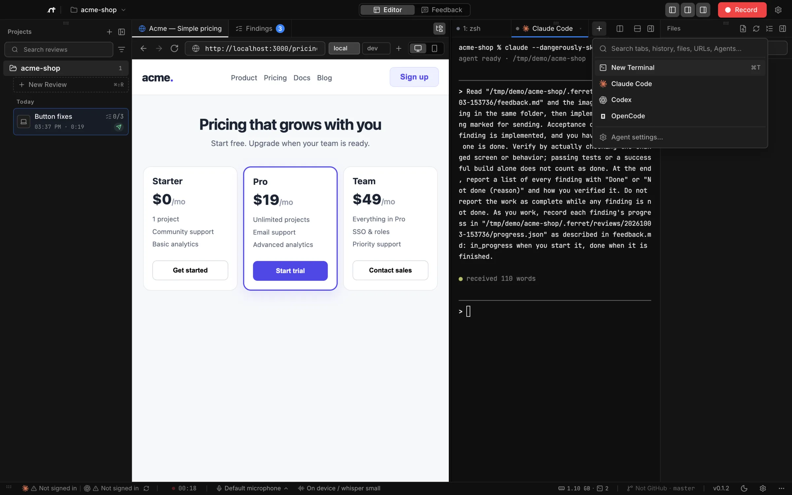
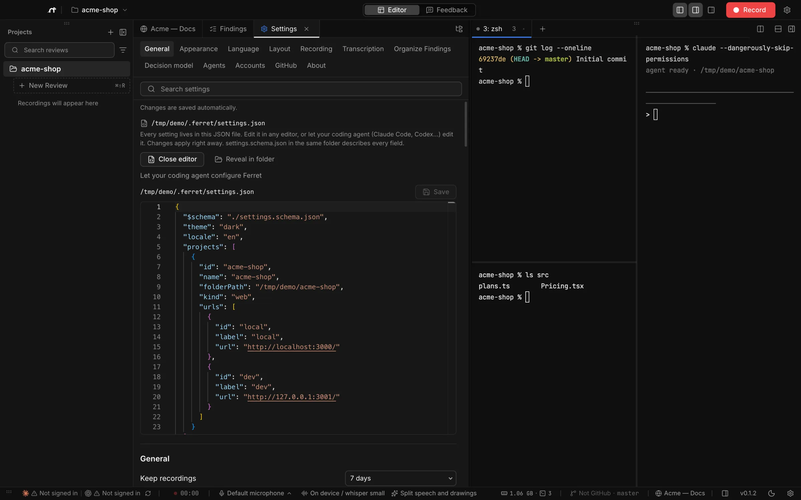
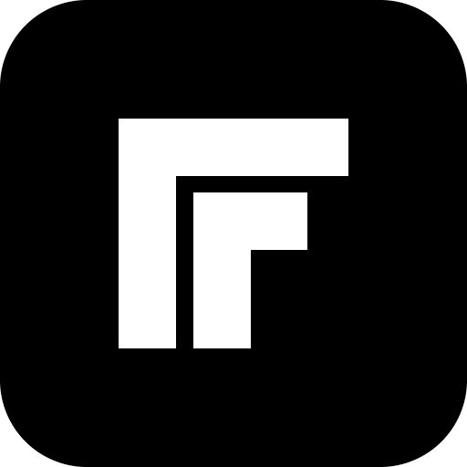

<!--
  README layout modeled on stablyai/orca. Images live in docs/images/ (screenshots of a neutral demo project).
  - docs/images/hero.gif: rendered from the landing page animation (site/js/hero.js, created with Claude Opus 5.5) by `node tools/docs/render-hero.mjs --readme`.
  - The agent grid between the agents:start/end markers is generated by `node tools/docs/readme-agents.mjs` from docs/images/agents/agents.json.
-->

<div align="center">

<picture>
  <source media="(prefers-color-scheme: dark)" srcset=".github/assets/ferret-wordmark-dark.svg">
  
</picture>

**The ADE for feedback by voice and screen.**<br>
Stop typing instructions. Point at the real screen, say what's wrong, and hand your agent dozens of precise findings at once.<br>
Do it live in meetings, and let a decision model check each fix. (ADE = Agentic Development Environment.)

[](https://github.com/JapanMarketing-Dev/ferret/stargazers)
[](https://ferretade.dev/download)
[](https://ferretade.dev/download)
[](LICENSE)
[](https://discord.gg/A5zAuwg866)
[](https://x.com/ai_agent_dev)

[Website](https://ferretade.dev) · [Download](https://ferretade.dev/download) · [Docs](https://ferretade.dev/docs/quick-start.html) · [Changelog](https://ferretade.dev/download#versions)

**English** · [日本語](README.ja.md)

<br>



</div>

<br>

## Don’t describe the screen. Point at it.

A typed prompt spends most of its words explaining where things are. Instead, use your app in the built-in browser, circle what bothers you with the pen, and say what you want. When you stop, every mark and every sentence becomes text: a **finding** with a still of your marks, what you said word for word, the URL and a clear **Done when** your agent can check. Talk as much as you like; on-device whisper transcribes it for free.





→ [Recording](https://ferretade.dev/docs/recording.html)

## Live in meetings: more feedback, all of it precise

Run it during an online meeting on Zoom, Meet or Teams, or around one screen in a room. Everyone points and talks while you record the built-in browser, any window or the whole screen. Instead of a few lines of meeting notes, your agent gets every remark as text, tied to the exact spot on the screen.



→ [Choosing what to record](https://ferretade.dev/docs/recording.html#target)

## A decision model checks it: you define “done”

Every finding carries a **Done when**. After implementing it, the agent sends a fresh screenshot and that condition to the **decision model** you choose, and keeps going until every finding passes, reporting **Done** or **Not done** with a score for each. That is how you know the agent did what you expected. Ferret itself never judges.

Works with TypeSafe Jev, Cloudflare Clef / Clef Flash (via Ollama or Workers AI), Vercel AI Gateway, or any compatible API, on your own key: you pay your provider directly, and Ferret never charges.



<sub>Real decision-model calls (Cloudflare Workers AI Clef Flash, 2 calls). AFTER images prepared for the demo. Ferret itself doesn't judge; the agent calls the decision model you configure.</sub>

→ [Sending to agents and verification](https://ferretade.dev/docs/agents.html#verify)

## More

| | |
|---|---|
| **Works with every agent.** Claude Code, Codex, Gemini CLI, Cursor, GitHub Copilot, Devin and more start in built-in terminals; Ferret hands them the findings. [Docs](https://ferretade.dev/docs/agents.html) | **Web, mobile and desktop targets.** Review a dev server URL, a mobile width or simulator window, or any desktop app window. Save each as a project target. [Docs](https://ferretade.dev/docs/projects.html) |
| **Configured by your agent.** Every setting lives in `~/.ferret/settings.json` with a JSON Schema, so your coding agent can set Ferret up for you. [Docs](https://ferretade.dev/docs/settings-json.html) | **Private by design.** There is no Ferret server for your work (the only exception, coming soon, is anonymous feedback you choose to send, which becomes a public GitHub issue). Bring your own keys, kept in your OS keystore. Videos are never sent to agents. [Docs](https://ferretade.dev/docs/privacy.html) |

<table>
  <tr>
    <td width="50%"><br><sub>Review targets: saved URLs and recent pages.</sub></td>
    <td width="50%"><br><sub>Send to Agent starts Claude Code and pastes the instructions (terminal output is a stand-in for the demo).</sub></td>
  </tr>
  <tr>
    <td width="50%"><br><sub>Start any agent from the terminal menu.</sub></td>
    <td width="50%"><br><sub>settings.json in the built-in editor.</sub></td>
  </tr>
</table>

## Supported agents

Ferret launches CLI agents in its built-in terminals, on the subscriptions you already have. For anything else, **Copy for Agent** copies the same instruction.

<!-- agents:start (generated by tools/docs/readme-agents.mjs from docs/images/agents/agents.json; do not edit by hand) -->
<table>
  <tr>
    <td align="center" width="16%"><a href="https://code.claude.com/docs/en/setup"><br><sub>Claude Code</sub></a></td>
    <td align="center" width="16%"><a href="https://github.com/openai/codex"><br><sub>Codex</sub></a></td>
    <td align="center" width="16%"><a href="https://github.com/xai-org/grok-build"><br><sub>Grok</sub></a></td>
    <td align="center" width="16%"><a href="https://cursor.com/docs/cli/installation"><br><sub>Cursor</sub></a></td>
    <td align="center" width="16%"><a href="https://docs.github.com/en/copilot/how-tos/set-up/install-copilot-cli"><br><sub>GitHub Copilot</sub></a></td>
    <td align="center" width="16%"><a href="https://dev.meta.ai/docs/muse-code"><br><sub>Muse</sub></a></td>
  </tr>
  <tr>
    <td align="center" width="16%"><a href="https://deepseek-harness.github.io/deepseek-harness/"><br><sub>DeepSeek Harness</sub></a></td>
    <td align="center" width="16%"><a href="https://zcode.z.ai/en/docs"><br><sub>ZCode</sub></a></td>
    <td align="center" width="16%"><a href="https://opencode.ai/docs/"><br><sub>OpenCode</sub></a></td>
    <td align="center" width="16%"><a href="https://mimo.xiaomi.com/coder"><br><sub>MiMo Code</sub></a></td>
    <td align="center" width="16%"><a href="https://ampcode.com/docs/cli"><br><sub>Amp</sub></a></td>
    <td align="center" width="16%"><a href="https://openclaude.gitlawb.com/"><br><sub>OpenClaude</sub></a></td>
  </tr>
  <tr>
    <td align="center" width="16%"><a href="https://antigravity.google/docs/cli/install"><br><sub>Antigravity</sub></a></td>
    <td align="center" width="16%"><a href="https://pi.dev"><br><sub>Pi</sub></a></td>
    <td align="center" width="16%"><a href="https://omp.sh/docs"><br><sub>oh-my-pi</sub></a></td>
    <td align="center" width="16%"><a href="https://hermes-agent.nousresearch.com/docs/"><br><sub>Hermes Agent</sub></a></td>
    <td align="center" width="16%"><a href="https://docs.devin.ai/work-with-devin/devin-cli"><br><sub>Devin</sub></a></td>
    <td align="center" width="16%"><a href="https://goose-docs.ai/docs/getting-started/installation/"><br><sub>Goose</sub></a></td>
  </tr>
  <tr>
    <td align="center" width="16%"><a href="https://docs.augmentcode.com/cli/overview"><br><sub>Auggie</sub></a></td>
    <td align="center" width="16%"><a href="https://github.com/autohandai/code-cli"><br><sub>Autohand Code</sub></a></td>
    <td align="center" width="16%"><a href="https://github.com/charmbracelet/crush"><br><sub>Charm (Crush)</sub></a></td>
    <td align="center" width="16%"><a href="https://docs.cline.bot/cline-cli/overview"><br><sub>Cline</sub></a></td>
    <td align="center" width="16%"><a href="https://www.codebuddy.ai/docs/cli/installation"><br><sub>CodeBuddy</sub></a></td>
    <td align="center" width="16%"><a href="https://www.codebuff.com/docs/help/quick-start"><br><sub>Codebuff</sub></a></td>
  </tr>
  <tr>
    <td align="center" width="16%"><a href="https://freebuff.com/cli"><br><sub>Freebuff</sub></a></td>
    <td align="center" width="16%"><a href="https://commandcode.ai/docs/quickstart"><br><sub>Command Code</sub></a></td>
    <td align="center" width="16%"><a href="https://docs.continue.dev/cli/quickstart"><br><sub>Continue</sub></a></td>
    <td align="center" width="16%"><a href="https://docs.factory.com/cli/getting-started/quickstart"><br><sub>Droid</sub></a></td>
    <td align="center" width="16%"><a href="https://kilo.ai/docs/code-with-ai/platforms/cli"><br><sub>Kilocode</sub></a></td>
    <td align="center" width="16%"><a href="https://www.kimi.com/code/docs/en/kimi-code-cli/guides/getting-started"><br><sub>Kimi</sub></a></td>
  </tr>
  <tr>
    <td align="center" width="16%"><a href="https://kiro.dev/docs/cli/"><br><sub>Kiro</sub></a></td>
    <td align="center" width="16%"><a href="https://github.com/mistralai/mistral-vibe"><br><sub>Mistral Vibe</sub></a></td>
    <td align="center" width="16%"><a href="https://github.com/QwenLM/qwen-code"><br><sub>Qwen Code</sub></a></td>
    <td align="center" width="16%"><a href="https://support.atlassian.com/rovo/docs/install-and-run-rovo-dev-cli-on-your-device/"><br><sub>Rovo Dev</sub></a></td>
    <td align="center" width="16%"><a href="https://github.com/google-gemini/gemini-cli"><br><sub>Gemini CLI</sub></a></td>
    <td align="center" width="16%"><a href="https://aider.chat/docs/install.html"><br><sub>Aider</sub></a></td>
  </tr>
  <tr>
    <td align="center" width="16%"><a href="https://ante.run/start/quickstart/"><br><sub>Ante</sub></a></td>
    <td align="center" width="16%"><a href="https://docs.blackbox.ai/features/blackbox-cli/getting-started"><br><sub>BLACKBOX CLI</sub></a></td>
    <td align="center" width="16%"><a href="https://forgecode.dev/docs/"><br><sub>ForgeCode</sub></a></td>
    <td align="center" width="16%"><a href="https://junie.jetbrains.com/docs/junie-cli.html"><br><sub>Junie CLI</sub></a></td>
    <td align="center" width="16%"><a href="https://github.com/letta-ai/letta-code"><br><sub>Letta Code</sub></a></td>
    <td align="center" width="16%"><a href="https://github.com/openclaw/openclaw"><br><sub>OpenClaw</sub></a></td>
  </tr>
  <tr>
    <td align="center" width="16%"><a href="https://docs.openhands.dev/openhands/usage/cli/installation"><br><sub>OpenHands CLI</sub></a></td>
    <td align="center" width="16%"><a href="https://github.com/PrimeIntellect-ai/prime-agent"><br><sub>Prime Agent</sub></a></td>
    <td align="center" width="16%"><a href="https://docs.qoder.com/cli/installation"><br><sub>Qoder CLI</sub></a></td>
    <td align="center" width="16%"><a href="https://github.com/RooCodeInc/Roo-Code/tree/main/apps/cli"><br><sub>Roo Code CLI</sub></a></td>
    <td align="center" width="16%"><a href="https://docs.trae.cn/cli_get-started-with-trae-code-cli-2"><br><sub>Trae CLI</sub></a></td>
    <td align="center"><sub>…and any CLI agent</sub></td>
  </tr>
</table>
<!-- agents:end -->

## Download

| macOS | Windows | Linux |
|---|---|---|
| Apple silicon / Intel · `.dmg` | x64 / Arm64 · installer `.exe` | x64 · AppImage / `.deb` |

Get the latest build, or any earlier version, from **[ferretade.dev/download](https://ferretade.dev/download)**. The macOS build is signed with a Developer ID and notarized by Apple (since 0.2.0 build 3), so it opens like any other app. Windows and Linux builds are not code-signed yet; see [Install](https://ferretade.dev/docs/install.html) for their first-launch step.

## Quick start

1. Open a project folder and your dev server URL (for example `http://localhost:3000`).
2. Press **Record** (⌘⇧R / Ctrl+Shift+R), circle and talk. Then stop.
3. Review the findings, then **Send to Agent**. The agent implements them and verifies each one against your screenshot.

Full walkthrough: [Quick start](https://ferretade.dev/docs/quick-start.html).

## Documentation

[Quick start](https://ferretade.dev/docs/quick-start.html) · [Install](https://ferretade.dev/docs/install.html) · [Recording](https://ferretade.dev/docs/recording.html) · [Sending to agents](https://ferretade.dev/docs/agents.html) · [Transcription and costs](https://ferretade.dev/docs/transcription.html) · [Settings](https://ferretade.dev/docs/settings.html) · [Keyboard shortcuts](https://ferretade.dev/docs/keyboard.html) · [Data and privacy](https://ferretade.dev/docs/privacy.html) · [Troubleshooting](https://ferretade.dev/docs/troubleshooting.html)

## Contributing

Bug reports and pull requests are welcome; see [CONTRIBUTING.md](CONTRIBUTING.md). Development happens on `develop`. To report a vulnerability, see [SECURITY.md](SECURITY.md).

```sh
git clone https://github.com/JapanMarketing-Dev/ferret.git
cd ferret
pnpm install
pnpm dev          # run the app from source (Node.js 22)
pnpm typecheck
pnpm test:unit
```

## License and credits

- [MIT](LICENSE), Copyright (c) 2026 JapanMarketing-Dev. Built by [Japan Marketing LLC](https://www.japan-marketing.co.jp/).
- Inspired by and partially derived from [Orca](https://github.com/stablyai/orca) (MIT). Ported code and bundled dependencies are listed in [THIRD_PARTY_NOTICES.md](THIRD_PARTY_NOTICES.md). Agent logos come from Orca and each vendor; names and logos are trademarks of their owners.
- The landing page hero animation was created with Claude Opus 5.5.

---

## About this build

- **What it does**: records and annotates a page opened in the built-in browser, turns your voice and pen marks into findings, lets you edit, merge and delete findings, and sends them to an agent (Codex / Claude Code) running in the built-in terminal.
- **You bring your own resources**: there is no server or API key on the developer's side for your work. The one exception, coming soon, is the optional in-app feedback form, whose small relay turns what you send into a public GitHub issue and does not store your IP address (`workers/feedback-relay`). Transcription runs on your machine (whisper.cpp, free), with your own OpenAI API key, or on an OpenAI-compatible server you host (for example on your own GPU). Agents run through the CLI subscriptions you already have.
- **Platforms**: macOS (Apple Silicon / Intel), Windows (x64 / arm64) and Linux (x64). Day-to-day use is on macOS (Apple Silicon). Every release is checked on a Mac: `tools/qa/linux-smoke.sh` packages the Linux app in a Linux container and runs `e2e/platform-smoke.spec.ts` against it under xvfb (launch, built-in browser, a shell in the terminal, settings), and `scripts/check-win-unpacked.mjs` and `scripts/check-nsis-archive.mjs` check that the Windows apps and installers carry the right binaries for each CPU. The Intel macOS build's terminal was checked under Rosetta. The macOS build is signed with a Developer ID and notarized; Windows and Linux builds are not code-signed yet.

## Install and run

To run from source, use Node.js 22 and pnpm. On Linux, `pnpm install` compiles the terminal's native module (node-pty), so install `build-essential` and `python3` first. On Windows, the bundled prebuilt node-pty is used and no compiler is needed.

```sh
git clone https://github.com/JapanMarketing-Dev/ferret.git
cd ferret
pnpm install
pnpm dev
```

Open a project folder and a URL in the app, start recording, circle what you want changed and say it, then stop. Feedback is voice and pen.

While recording, the target page is shown large. You can draw while the pen button is on, or while holding Option / Alt. Start or stop recording with ⌘⇧R, and switch modes with ⌘⇧M (Ctrl+Shift+R / Ctrl+Shift+M on Windows and Linux). Pausing stops both drawing and the timer.

When you stop, you return to the list of findings. You can enlarge or replace images, replay the recording, edit findings, choose which ones to send, confirm, merge, delete, and undo edits.

## Transcription and agents

Speech-to-text runs on your own key or your own hardware, at your own cost. Choose the provider under Settings > Transcription.

- **This device (free, default)**: install the `whisper.cpp` CLI and a GGML model, then select the model in Settings.
- **OpenAI (your API key)**: audio is sent to OpenAI.
- **OpenAI-compatible**: enter a base URL, a model name and an optional API key. Ferret sends audio in the `/v1/audio/transcriptions` format to servers such as faster-whisper-server, speaches, whisper.cpp server or vLLM on your own GPU, or to hosted services.
- **Other providers (your API key)**: Groq, Deepgram, ElevenLabs Scribe, Google Gemini, Mistral Voxtral, Azure OpenAI and OpenRouter come as presets with the base URL and model filled in. You can change the base URL, model, timeout and extra headers. Non-OpenAI-style APIs (Deepgram, ElevenLabs, Gemini, OpenRouter audio input) use small per-provider adapters.

"Test connection" sends one second of silence to check authentication, URL and model name. API keys are encrypted with the OS keystore (macOS Keychain / Windows DPAPI / Linux libsecret or KWallet) and stored separately from the settings. Where encryption is not available (for example Linux without a keyring), the key is kept only for the current session. In development you can also put `OPENAI_API_KEY` in the git-ignored `.env`. Never put keys in source code.

Each review has an estimated cost limit (default $1, configurable). For compatible servers with unknown pricing, Ferret estimates $0.006 per minute; you can also set no limit. When the limit is reached, Ferret stops sending and keeps the audio. It does not retry automatically on API errors.

"Organize findings" uses the CLI you subscribe to (Claude Code / Codex) in non-interactive mode. It receives only text and interaction data, never audio, video or images. If organizing fails, you can still use the original text and images. Ferret never falls back to an API key on its own. You can instead call an LLM directly with your own API key (Anthropic, OpenAI, Google Gemini, OpenRouter, or any OpenAI-compatible endpoint): set it up under Settings > Organize findings, with any model name, then pick it next to the Organize button. The output is constrained by JSON Schema where the provider supports it and is always validated. Keys are stored per provider and shared between transcription and organizing. Everything is sent directly from your computer with your key; there is no relay server, and packaged builds never read keys from environment variables.

Start an agent in the built-in terminal and press "Send to Agent": Ferret types and runs an instruction that points the agent to the saved findings. It holds off while the agent is waiting for a permission prompt or when the destination is unclear. For an external agent, "Copy for Agent" copies the same instruction. Videos are never included.

## Storage

Ferret saves `feedback.md`, images, `session.json`, an interaction log and the recording under `<project>/.ferret/reviews/<timestamp>/`, and adds that folder to Git's local exclude list. If a review was interrupted, you can restore it from the history, and Ferret tells you when something may be missing.

Working images, audio and video of completed reviews are deleted on startup after the retention period (default 7 days). Exported findings and their images are kept. Incomplete reviews are never deleted.

## What leaves your machine

Ferret connects to outside services only for:

- transcription and "Organize" with your own API key (the provider or endpoint you choose)
- Whisper model downloads (Hugging Face)
- agent usage in the footer (each provider's API, with your own Claude / Codex login)
- "Send to GitHub" (through your own `gh` CLI)
- "Check for Updates", only when you click it (the download server on Cloudflare R2)
- **feedback from the app** (coming soon), only when you send it: your text, bug or idea, app version, OS version if you include it, and up to 3 screenshots go through the developer's relay and become a public issue in `JapanMarketing-Dev/ferret`. Keys, tokens, email addresses and home-folder paths are masked, and the relay does not store your IP address. See [Data and privacy](https://ferretade.dev/docs/privacy.html#feedback).
- **crash reports (Sentry)**: the app sends crashes and unhandled errors. It is on by default; turn it off in Settings → Privacy or from the notice at first launch. Reports contain the stack trace and OS / CPU / app versions. Paths, URLs, terminal output, transcripts, findings, email addresses, API keys and IP addresses are removed or not collected. Development builds (`pnpm dev`) also send, tagged `development`; E2E runs and unit tests never send. Forks can set `FERRET_SENTRY_DSN` (the old `MOVIE_ADE_SENTRY_DSN` still works) to their own DSN, or to an empty string to disable it. See [Data and privacy](https://ferretade.dev/docs/privacy.html#crash-reports).

## Development

```sh
pnpm typecheck
pnpm test:unit
pnpm build:mac:dev    # dist/dev/mac-arm64/Ferret.app
pnpm build:win:dev    # dist/dev/win-unpacked/Ferret-Dev.exe
pnpm build:linux:dev  # dist/dev/linux-unpacked/ferret-dev (build on Linux only)
```

These build unsigned, unpacked dev apps for a quick check (`electron-builder.dev.cjs`, a separate app ID so they do not mix with release builds). Release settings are in `electron-builder.config.cjs`. `scripts/build-release.sh` signs and notarizes the macOS build with a Developer ID when `~/.ferret-signing/env` exists (the values never go into the repository); without it, macOS builds are only ad-hoc signed. Windows builds can also be made on a Mac. Linux builds must be made on Linux (or in a Linux container) because node-pty has no prebuilt Linux binary. The app never bundles `.env`. User data stays in the `ade-movie` folder even though the product is named Ferret.

### Releases

The macOS installers are signed with a Developer ID and notarized; the Windows and Linux installers are not code-signed yet. They are hosted on Cloudflare R2 (bucket `movie-ade-releases`), not on GitHub. So that a second source exists outside R2, each version also gets a GitHub release with only a `SHA256SUMS` file attached (the same values as its `manifest.json`); the installers themselves are never attached to GitHub.

```sh
pnpm dist:mac    # Ferret-<version>-mac-arm64.dmg / -mac-x64.dmg
pnpm dist:win    # Ferret-<version>-win-x64.exe / -win-arm64.exe (NSIS)
pnpm dist:linux  # Ferret-<version>-linux-x86_64.AppImage / -linux-amd64.deb (on Linux)
node scripts/release-r2.mjs stage --dir dist/release [--notes notes.md] [--dry-run]
node scripts/release-github.mjs create --version <version> [--target <commit>] [--dry-run]   # draft GitHub release with SHA256SUMS only
gh release download v<version> --repo JapanMarketing-Dev/ferret --pattern SHA256SUMS --dir <dir>
node scripts/release-r2.mjs promote --version <version> --expect-sums <dir>/SHA256SUMS [--dry-run]
node scripts/release-github.mjs publish --version <version> [--dry-run]                     # make the draft public
node scripts/release-r2.mjs discard --version <version> [--dry-run]   # drop a staged version you won't publish
```

On a Mac, the whole local release is `pnpm release:build` (type checks, unit tests, then all six installers into `dist/release`; Linux is built in an x64 podman or docker container) → `pnpm release:r2 stage` → check → `pnpm release:r2 promote --version <version>`.

Publishing has two steps. `stage` uploads the files and `manifest.json` (file name, OS, CPU, size, sha256, date) to `staging/<version>/` without touching the indexes, so neither the site nor the app's update check sees them yet. After checking them, `promote` verifies each file's sha256, moves it to `releases/<version>/`, updates `versions.json` and `latest.json`, and removes the staging copy. Release files are cached for a year (they never change), manifests for an hour, the indexes for five minutes. Both steps refuse a version that is already released. Only the latest 10 versions are kept: `promote` prints and deletes older ones. Uploads use `wrangler r2 object put --remote` (300 MiB per file). wrangler is a pinned devDependency (version and integrity in `pnpm-lock.yaml`) started with `node` directly, without a shell; log in with `node scripts/release-tools.mjs wrangler login` first. Manifests and indexes read back from R2 are schema-checked before use, and `--expect-sums` stops if the manifest does not match the `SHA256SUMS` file from the GitHub release (the workflow always passes it). `scripts/release-github.mjs create` builds that file from the staged manifest (`--from releases` for a version that is already promoted, `--manifest <file>` for a local copy).

Pushing a `v*` tag that matches `package.json` runs `.github/workflows/release.yml`: it builds on macOS, Windows and Linux, writes `SHA256SUMS`, creates a draft GitHub release with the notes and `SHA256SUMS` (no installers), and stages the files on R2. Jobs that hold the R2 token cannot write to the repository and vice versa; actions are pinned to commit SHAs. To publish, run the same workflow by hand from the Actions tab with the version (or run `promote` locally). Promotion checks the staged manifest against that release's `SHA256SUMS`; after a `--replace` rebuild, upload the new file first (`gh release upload v<version> SHA256SUMS --clobber`). It needs two repository secrets, plus an optional third:

1. `CLOUDFLARE_API_TOKEN`: in the Cloudflare dashboard, go to My Profile → API Tokens → Create Token → Create Custom Token. Grant **Account → Workers R2 Storage → Edit** for this account only, and set a short expiry if you can. Copy the token once.
2. `CLOUDFLARE_ACCOUNT_ID`: shown on the R2 overview page.
3. `SENTRY_AUTH_TOKEN`: uploads source maps so crash reports show readable stack traces (`scripts/sentry-sourcemaps.mjs`, run by `pnpm build:release`). In Sentry, go to Settings → Developer Settings → Organization Tokens → Create New Token (organization tokens can only upload source maps and manage releases). Until it is registered, the workflow only warns and skips the upload; once it is registered, you can add `SENTRY_SOURCEMAPS: required` to the build job's env in `release.yml` so a failed upload stops the release. Locally, the pinned `sentry` CLI from devDependencies is used instead (log in once with `pnpm exec sentry auth login`); the scripts never fetch a CLI with npx or use one from `PATH`, and stop if the pinned one is not installed, and the step is skipped with a warning if neither is available. Override the target with `SENTRY_ORG` / `SENTRY_PROJECT` (default `workspacepm` / `movie-ade`).

Add them under GitHub → Settings → Secrets and variables → Actions. Optional repository variables: `PREVIEW_OS` (OSes to mark as Preview, such as `win,linux`; empty by default) and `DOWNLOAD_URL` (the link in the release notes). The workflows run on free runners because the repository is public; in a private repository the minutes, especially on macOS, are billed to the owner. `.github/workflows/cross-platform.yml` runs type checks, unit tests and unpacked builds on all three OSes (one macOS job) on every push and pull request; switch it to manual-only if the repository ever becomes private.

Requirements and design documents (in Japanese) are in [docs/02_requirements.md](docs/02_requirements.md) and [docs/03_design.md](docs/03_design.md). `main` is for releases. Development happens on `develop`; open pull requests against `develop`.

## Download site

`site/` is a static site with no build step (no external CDN), published on Cloudflare Pages at https://ferretade.dev (custom domain of the Pages project `movie-ade`; the old https://movie-ade.pages.dev is retired and sends visitors to the same page on ferretade.dev via `site/js/theme.js`, and `site/_headers` keeps it out of search). `wrangler.jsonc` points Pages at `site/`; `site/_headers` sets security and cache headers, `site/_redirects` holds short aliases, and `site/404.html` is the not-found page. Preview it locally with `pnpm lp:dev` (`http://127.0.0.1:4173/`).

Release files are hosted on Cloudflare R2 (the 10 most recent versions), not in the repository. The site reads `versions.json`, `latest.json` and `releases/<version>/manifest.json` from the R2 URL set in `site/js/config.js` (`DOWNLOAD_BASE`, the only place to change for a custom domain). Until a release is published, the site shows build-from-source instructions.

To deploy, either run `pnpm site:deploy` (uploads `site/` to the Pages project `movie-ade`; requires `wrangler login`), or connect the Pages project `movie-ade` to `JapanMarketing-Dev/ferret` in the Cloudflare dashboard with an empty build command and `site` as the output directory. The site URL (`SITE_URL`) is also in `site/js/config.js`; after changing it, run `pnpm site:meta` to rewrite `og:image`, `og:url` and `canonical` in the HTML.
